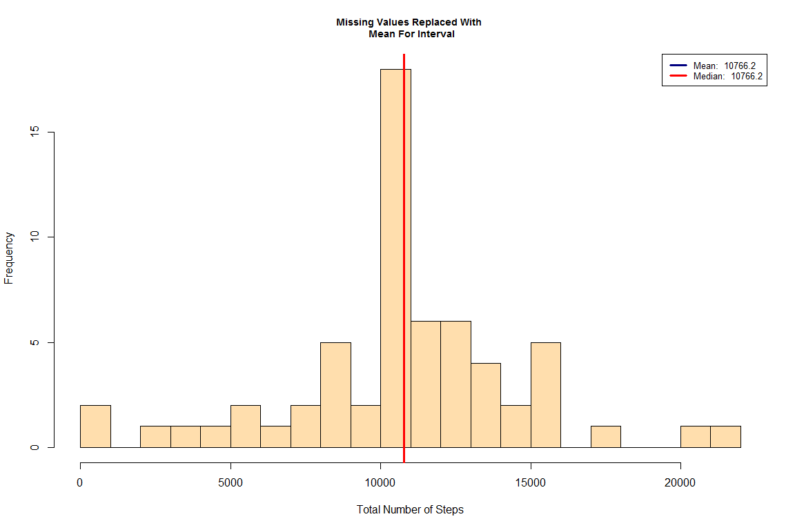

# Peer Assessment 1, Reproducable Research

**This document contains the completed work for peer assignment #1 for the Coursera Reproducable Research class.**

###Loading & Preprocessing Data

---

First, Removing all variables from the environment

```r
#removes all variables from environment
rm(list=ls(all=TRUE))
```


Next, Downloading the dataset required for this assignment.  Description of this data from course website: 

*This assignment makes use of data from a personal activity monitoring device. This device collects data at 5 minute intervals through out the day. The data consists of two months of data from an anonymous individual collected during the months of October and November, 2012 and include the number of steps taken in 5 minute intervals each day.*


The variables included in this dataset are:

1. **steps**: Number of steps taking in a 5-minute interval (missing values are coded as NA ) 
2. **date**: The date on which the measurement was taken in YYYY-MM-DD format 
3. **interval**: Identifier for the 5-minute interval in which measurement was taken

Next, Reading data into a dataframe and inspecting the structure of the data

```
## [1] "steps"    "date"     "interval"
```

```
## 'data.frame':	17568 obs. of  3 variables:
##  $ steps   : int  NA NA NA NA NA NA NA NA NA NA ...
##  $ date    : Factor w/ 61 levels "2012-10-01","2012-10-02",..: 1 1 1 1 1 1 1 1 1 1 ...
##  $ interval: int  0 5 10 15 20 25 30 35 40 45 ...
```

```
##   steps       date interval
## 1    NA 2012-10-01        0
## 2    NA 2012-10-01        5
## 3    NA 2012-10-01       10
## 4    NA 2012-10-01       15
## 5    NA 2012-10-01       20
## 6    NA 2012-10-01       25
```


###Histogram, Mean & Median

---

Next, Generating histogram of the total number of steps taken each day, but first let us summarize the data by day:


**Make The Histogram, And Report on Mean and Median:**

The below histogram addresses the following items:

1.  Make a histogram of the total number of steps taken each day
2.  Calculate and report the mean and median total number of steps taken per day

**Note: Mean and Median Are Reported In Legend Of Histogram**

<!-- -->


###Daily Activity Pattern

----------------------------


**Next, Visualizing the daily activity pattern**

The below plot addresses the following items:

1.  Make a time series plot (i.e. type = "l") of the 5-minute interval (x-axis) and the average number of steps taken, averaged across all days (y-axis)
2.  Which 5-minute interval, on average across all the days in the dataset, contains the maximum number of steps?


<!-- -->

---

###Missing Values

1. Calculate & Report The Number of Missing Values

```
## [1] 2304
```

1. Devise a strategy for filling in all of the missing values in the dataset. The strategy does not need to be sophisticated. For example, you could use the mean/median for that day, or the mean for that 5-minute interval, etc.

2. Create a new dataset that is equal to the original dataset but with the missing data filled in.

```
##          date new_steps
## 1: 2012-10-01  10766.19
## 2: 2012-10-02    126.00
## 3: 2012-10-03  11352.00
## 4: 2012-10-04  12116.00
## 5: 2012-10-05  13294.00
## 6: 2012-10-06  15420.00
```

4.  Make a histogram of the total number of steps taken each day and Calculate and report the mean and median total number of steps taken per day. Do these values differ from the estimates from the first part of the assignment? What is the impact of imputing missing data on the estimates of the total daily number of steps?

**Note: Mean and Median Are Reported In Legend Of Histogram**

<!-- --><!-- -->

**Answer To Question:**
The mean and the median are now almost the same after replacing missing values with the mean value for the relevant interval. It makes sense that the median value would now move closer to the mean. So the Median value increased after this method of missing value replacement.

###Are there differences in activity patterns between weekdays and weekends?

---
1.  Create a new factor variable in the dataset with two levels – “weekday” and “weekend” indicating whether a given date is a weekday or weekend day.

```
## Classes 'data.table' and 'data.frame':	576 obs. of  3 variables:
##  $ interval : int  0 0 5 5 10 10 15 15 20 20 ...
##  $ daytype  : Factor w/ 2 levels "Weekday","Weekend": 1 2 1 2 1 2 1 2 1 2 ...
##  $ avg_steps: num  2.2512 0.2146 0.4453 0.0425 0.1732 ...
##  - attr(*, ".internal.selfref")=<externalptr>
```

Below is the panel plot:
<!-- -->
